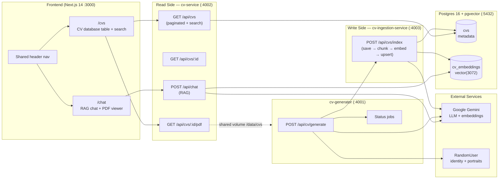
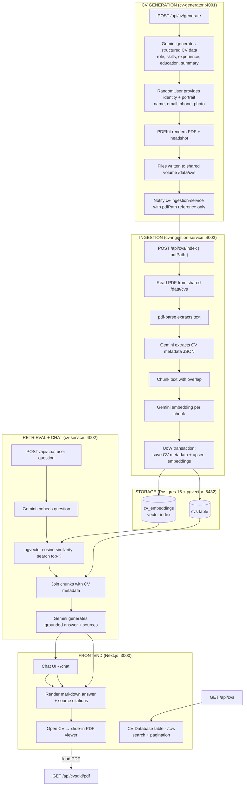

# LeadTech CV Screening

An AI-powered, end-to-end CV screening tool. The system **generates** realistic fake CVs,
**ingests** them into a searchable vector knowledge base, and provides a **chat interface**
that answers questions about the candidates using Retrieval-Augmented Generation (RAG) —
with grounded citations back to the source CVs, and a browsable CV database table.

This project was built **by AI agents** (see [How AI was used](#how-ai-was-used)) as a
demonstration of both a working product and an AI-driven software delivery workflow.

---

## Table of Contents

- [LeadTech CV Screening](#leadtech-cv-screening)
  - [Table of Contents](#table-of-contents)
  - [System Overview](#system-overview)
  - [Features](#features)
  - [Architecture](#architecture)
  - [Patterns Used](#patterns-used)
  - [Complete Workflow](#complete-workflow)
  - [How AI Was Used](#how-ai-was-used)
    - [1. AI as part of the product (runtime)](#1-ai-as-part-of-the-product-runtime)
    - [2. AI as the development engine (how it was built)](#2-ai-as-the-development-engine-how-it-was-built)
  - [The AI-Driven Development Workflow](#the-ai-driven-development-workflow)
    - [Harness tuning for automation](#harness-tuning-for-automation)
  - [The Role of the Markdown Files](#the-role-of-the-markdown-files)
  - [Getting Started](#getting-started)
    - [Prerequisites](#prerequisites)
    - [1. Configure environment](#1-configure-environment)
    - [2. Start the full stack](#2-start-the-full-stack)
    - [3. Generate CVs](#3-generate-cvs)
    - [4. Use the app](#4-use-the-app)
    - [Development (without Docker)](#development-without-docker)
  - [Project Structure](#project-structure)
  - [Testing](#testing)
  - [Environment Variables](#environment-variables)

---

## System Overview

LeadTech CV Screening is a containerized, full-stack TypeScript application composed of five
services orchestrated with Docker Compose:

| Service | Port | Responsibility |
|---------|------|----------------|
| `frontend` | 3000 | Next.js 14 App Router SPA — chat UI, CV database table, PDF viewer |
| `cv-service` | 4002 | **Read side** (CQRS query): RAG chat, CV metadata + PDF endpoints |
| `cv-ingestion-service` | 4003 | **Write side** (CQRS command): read PDF by reference, extract text + metadata via Gemini, save/chunk/embed |
| `cv-generator` | 4001 | Produces CVs: data generation, photo, PDF rendering, shares pdfPath reference with the ingestor |
| `postgres` | 5432 | PostgreSQL 16 with `pgvector` for metadata + embeddings |

The architecture follows **CQRS split at the service boundary**: reads and writes live in
separate deployable services. The frontend only ever talks to the read side (`cv-service`);
CV generation is the only component that writes.

---

## Features

- **CV Generation** — generates 25-30 unique, realistic fake CVs with varied roles,
  culturally diverse names, unique contacts/companies/schools, and AI-generated portraits.
  Candidate identity (name, email, phone, photo) comes from RandomUser; role, skills,
  experience, education, and professional summary are generated by Gemini. Rendered to PDF
  via PDFKit.
- **RAG Chat** (`/chat`) — ask questions in natural language; the LLM answers grounded only in
  retrieved CV content, with source citations. Markdown answers, hover tooltips with candidate
  details + copy-to-clipboard, and a slide-in PDF viewer.
- **Chat persistence** — conversation history saved to browser `localStorage` for **1 hour**,
  survives refresh, with a "Clear conversation" button.
- **CV Database** (`/cvs`) — a table of all candidates (Name, Role, Phone + copy, Email + copy,
  Skills chips, Open CV) with **database-level search** by name/role and pagination (page size 10).
- **Resilience** — Gemini calls retried with exponential backoff + jitter on `429`/`5xx`, and a
  generation delay to avoid rate limits.

---

## Architecture



---

## Patterns Used

| Pattern | Where | Purpose |
|---------|-------|---------|
| **CQRS (read/write split)** | `cv-service` vs `cv-ingestion-service` | Separate deployable read side from write side; the frontend never writes, and the generator never reads over HTTP |
| **Domain-Driven Design (DDD)** | `src/domain`, `application`, `infrastructure`, `interfaces` in each service | Layered, single-responsibility organization with rich domain entities |
| **Unit of Work (UoW)** | `cv-ingestion-service/application/cv/unit-of-work.ts` + `infrastructure/database/unit-of-work.impl.ts` | Wraps CV save + chunk embed + embedding upsert in a single DB transaction (`BEGIN` / `COMMIT` / `ROLLBACK`) |
| **Dependency Injection (DI)** | `di.container.ts` in each service (awilix) | Constructor-injected services and repositories; centralized wiring and testability |
| **Repository pattern** | `cv.repository.ts`, `embedding.repository.impl.ts` | Abstracts data access behind interfaces so the domain/application layers are storage-agnostic |
| **RESTful API** | Express routers/controllers (`/api/...`) | Resource-oriented endpoints with standard verbs and status codes |
| **RAG (Retrieval-Augmented Generation)** | `cv-service/application/chat` | Grounds LLM answers in retrieved CV chunks to reduce hallucination and cite sources |
| **Layered Architecture** | domain → application → infrastructure → interfaces | Clean separation of concerns with inward dependencies |
| **Error model / middleware** | `app-error` (DomainError), `error.middleware.ts` | Uniform error responses with codes and request IDs across all endpoints |
| **Strategy/Config via env** | `di.container.ts`, `.env` | RAG knobs (`CHUNK_SIZE`, `CHUNK_OVERLAP`, `TOP_K_SOURCES`) and retry settings are externally configurable |

---

## Complete Workflow

The full pipeline — from generating synthetic CVs to answering questions about them in the
frontend:



---

## How AI Was Used

AI is used in **two distinct ways** in this project:

### 1. AI as part of the product (runtime)

- **Content generation** — the `cv-generator` calls **Google Gemini** to produce realistic
  structured CV data (roles, skills, experience, education, professional summaries) that would
  otherwise be tediously hand-authored. Candidate identity — name, email, phone, and a
  gender-matched portrait — is fetched from the RandomUser API.
- **RAG embeddings** — both generated CV text and user questions are converted to vector
  embeddings via Gemini's embedding model.
- **Metadata extraction** — on the ingestion write side (`cv-ingestion-service`), Gemini is
  ALSO used to extract structured CV metadata (name, email, phone, role, summary, skills,
  education, experience) from parsed PDF text before the CV is embedded and stored.
- **Grounded chat** — the LLM answers are constrained by prompt engineering to rely only on the
  retrieved CV context, producing answers with **source attribution** instead of free invention.

### 2. AI as the development engine (how it was built)

This repository was planned, written, tested, and documented by an **AI orchestrator** driving
specialized **subagents** according to an explicit, human-authored **workflow specification** in
[`AGENTS.md`](AGENTS.md). Humans set constraints (the problem brief, architecture decisions, and
acceptance criteria); AI agents executed the mechanical work of code generation, wiring, and
iterative validation. See the next section.

---

## The AI-Driven Development Workflow

This project demonstrates **SDD (Spec-Driven Development)** — an approach where AI agents
autonomously implement features by following a written specification and an orchestration loop:

1. A human writes and maintains the **specification** (the problem brief, requirements, and
   roadmap).
2. An **orchestrator agent** reads `ROADMAP.md`, picks the next task whose dependencies are all
   complete, marks it in-progress, and spawns a **subagent** with a precise task context.
3. Each subagent follows a strict **4-phase lifecycle**: **Plan/Explore** (read-only) →
   **Implement** (write) → **Validate** (build/test) → **Report**.
4. The orchestrator records progress back into the roadmap and `current-task.md`, retries
   failures with backoff, and stops on a failure threshold.
5. This yields a self-auditing, reproducible pipeline where every feature is decomposed into
   checkable tasks and every task is validated before the next begins.

### Harness tuning for automation

For the agents to work effectively, the repository was tuned as a **harness**:

- **Deterministic task decomposition** — features are broken into small, dependency-ordered tasks
  with explicit acceptance criteria, so agents always know *what done looks like*.
- **Machine-readable status tracking** — task statuses use a simple symbol convention
  (`[ ]`/`[~]`/`[x]`/`[!]`) so the orchestrator can programmatically select the next task.
- **Explicit validation commands** — each task lists exact `pnpm build --filter <svc>` /
  `pnpm test --filter <svc>` commands, making "pass/fail" unambiguous and verifiable by agents.
- **Pattern templates** — `AGENTS.md` ships exact file lists, templates, and agent-to-agent
  message contracts (e.g. `TASK_CONTEXT`, `TASK_RESULT`), reducing ambiguity for the LLM.
- **Modularity & testability** — a strict layered (DDD) structure, `di.container.ts` wiring, and a
  shared types package mean agents can implement features in isolation without breaking others.

---

## The Role of the Markdown Files

The repository treats Markdown as an **operating specification**, not just documentation:

| File | Role |
|------|------|
| [`AGENTS.md`](AGENTS.md) | The "constitution" for the AI agents. Defines the orchestrator loop, subagent lifecycle (plan → implement → validate → report), task-selection algorithm, retry/failure policies, and the exact templates/contracts for agent communication. |
| [`ROADMAP.md`](ROADMAP.md) | The master task list. Each task is a numbered, dependency-ordered unit with acceptance criteria, file lists, and validation commands. Statuses (`[ ]`/`[~]`/`[x]`/`[!]`) drive the orchestrator's next-action decision. This is the to-do system the agents execute from. |
| [`current-task.md`](current-task.md) | A living artifact for whatever task is currently in flight. Records the plan, files created/modified, key decisions, and validation results — giving a snapshot of progress at any moment. |
| [`ARCHITECTURE.md`](ARCHITECTURE.md) | The technical blueprint: CQRS split, service responsibilities, API design, DDD layering, data flows, storage abstraction, error model, and database schema. Agents reference this to place new code correctly. |
| [`REQUIREMENTS.md`](REQUIREMENTS.md) | Functional and non-functional requirements plus a **Decisions Log** (a documented record of architectural choices and their rationale, e.g. Gemini, pgvector, PDFKit, CQRS). |
| [`problem-brief.txt`](problem-brief.txt) | The original human-authored problem statement that defines the business goal and evaluation criteria. |

In practice: *the `.md` files are the single source of truth that humans edit to steer the
project, and that agents read to know what to build and how to build it.*

---

## Getting Started

### Prerequisites

- [Node.js](https://nodejs.org) 18+ and [pnpm](https://pnpm.io)
- [Docker](https://www.docker.com) + Docker Compose
- A [Google AI Studio](https://aistudio.google.com/apikey) API key (for Gemini)

### 1. Configure environment

Copy `.env` and set your Gemini API key:

```bash
cp .env .env.local   # or edit .env directly
# Set GEMINI_API_KEY=your_key_here
```

### 2. Start the full stack

```bash
pnpm install
docker compose up --build
```

This brings up Postgres, `cv-service`, `cv-ingestion-service`, `cv-generator`, and `frontend`.

### 3. Generate CVs

With the stack running, trigger CV generation:

```bash
curl -X POST http://localhost:4001/api/cv/generate -H "Content-Type: application/json" -d '{"count": 30}'
```

### 4. Use the app

- **Chat** → http://localhost:3000/chat
- **CV Database** → http://localhost:3000/cvs

Example questions: *"Who has experience with Python?"*, *"Which candidate graduated from MIT?"*,
*"Summarize the profile of Jane Doe."*

### Development (without Docker)

```bash
pnpm build:shared
pnpm dev:cv-service
pnpm dev:cv-ingestion-service
pnpm dev:cv-generator
pnpm dev:frontend
```

---

## Project Structure

```
leadtech-cv-screening/
├── packages/shared/             # Shared types, value objects, domain errors, storage interface
├── services/
│   ├── frontend/                # Next.js 14 + Tailwind (chat UI, CV table, PDF viewer, nav)
│   ├── cv-service/              # CQRS read: Express + RAG chat + CV metadata/PDF endpoints
│   ├── cv-ingestion-service/    # CQRS write: save → chunk → embed → upsert (with UoW)
│   └── cv-generator/            # CV data gen, photo fetch, PDF render, shares pdfPath reference
├── infrastructure/postgres/     # DB init SQL (pgvector + schema)
├── tests/e2e/                   # Playwright end-to-end specs
├── AGENTS.md                    # AI agent workflow specification
├── ROADMAP.md                   # Orchestrator task list
├── ARCHITECTURE.md              # Technical blueprint
├── REQUIREMENTS.md              # Requirements + decisions log
└── docker-compose.yml
```

---

## Testing

| Kind | Command | Scope |
|------|---------|-------|
| Unit | `pnpm --filter cv-service test` / `pnpm -r test` | Domain entities, services, repositories (Vitest) |
| Integration | `pnpm --filter cv-service test:integration` | API endpoints against a test setup (supertest + Vitest) |
| E2E | `pnpm test:e2e` | Playwright chat + CV generation flows |
| Lint | `pnpm -r lint` | ESLint (frontend) + TypeScript checks |

Smoke tests are the package builds: `pnpm -r build`.

---

## Environment Variables

Key variables (see `.env` for the full list):

| Variable | Description | Default |
|----------|-------------|---------|
| `GEMINI_API_KEY` | Google AI Studio key | — |
| `GEMINI_MODEL` | LLM used for generation/chat | `gemini-3.5-flash-lite` |
| `GEMINI_EMBEDDING_MODEL` | Embedding model | `gemini-embedding-001` |
| `CHUNK_SIZE` | RAG chunk size (tokens) | `512` |
| `CHUNK_OVERLAP` | Overlap between chunks | `50` |
| `TOP_K_SOURCES` | Number of similarity-search results | `3` |
| `GEMINI_RETRY_MAX` | Max embedding retries | `3` |
| `GEMINI_RETRY_BASE_DELAY_MS` | Backoff base delay | `250` |
| `GEMINI_RETRY_MAX_DELAY_MS` | Backoff cap | `8000` |
| `CV_GENERATION_DELAY_MS` | Delay between generation calls (rate-limit guard) | `60000` |
| `NEXT_PUBLIC_CV_SERVICE_URL` | cv-service URL used by the frontend | `http://localhost:4002` |
| `DATABASE_URL` | Postgres connection string | — |
